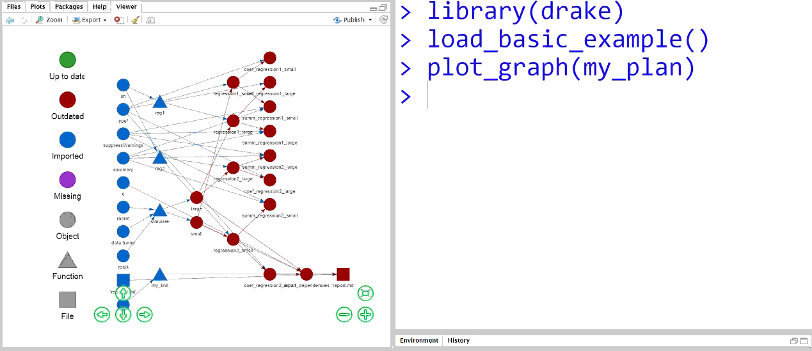

<h1 align="center">
  
</h1>

[](https://travis-ci.org/wlandau-lilly/drake)
[](https://ci.appveyor.com/project/wlandau-lilly/drake)
[](https://codecov.io/github/wlandau-lilly/drake?branch=master)
[](http://cran.r-project.org/package=drake)
[](https://www.gnu.org/licenses/gpl-3.0.en.html)
[](https://cran.r-project.org/)





# drake - data frames in R for [Make](http://kbroman.org/minimal_make/)

There is room to improve the conversation and the landscape of reproducibility in the R and Statistics communities. At a more basic level than scientific replicability, literate programming, and version control, reproducibility carries an implicit promise that the alleged results of an analysis really do match the code. Drake helps keep this promise by tracking the relationships among the components of the analysis, a rare and effective approach that also saves time. And with multiple parallel computing options that switch on auto-magically, drake is also a convenient and powerful high-performance computing solution.

# Landscape and context

The original idea of a time-saving reproducible build system extends back decades to [GNU Make](http://kbroman.org/minimal_make/), which today helps [data scientists](http://blog.kaggle.com/2012/10/15/make-for-data-scientists/) as well as the original user base of complied-language programmers. More recently, [Rich FitzJohn](http://richfitz.github.io/) created [remake](https://github.com/richfitz/remake), a breakthrough reimagining of [Make](http://kbroman.org/minimal_make/) for R and the most important inspiration for drake. Drake is a fresh reinterpretation of some of  [remake](https://github.com/richfitz/remake)'s pioneering fundamental concepts, scaled up for computationally-demanding workflows. 

Thanks also to [Kirill M&uuml;ller](http://krlmlr.github.io/) and [Daniel Falster](http://danielfalster.com/). They contributed code patches and enhancement ideas to my [parallelRemake](https://github.com/wlandau/parallelRemake) and [remakeGenerator](https://github.com/wlandau/remakeGenerator) packages, which I have now subsumed into drake.

In the sphere of reproducibility, drake and [remake](https://github.com/richfitz/remake) are examples of non-literate programming tools (as opposed to literate programming tools such as [knitr](https://CRAN.R-project.org/package=knitr)). Counterparts include [R.cache](https://CRAN.R-project.org/package=R.cache), [archivist](https://CRAN.R-project.org/package=archivist), [trackr](https://github.com/gmbecker/recordr), and [memoise](https://CRAN.R-project.org/package=memoise). See the [reporducible research CRAN task view](https://CRAN.R-project.org/view=ReproducibleResearch) for a more comprehensive list. Drake differentiates itself from these tools with its ability to track the relationships among cached objects and its extensive high-performance computing functionality.

# Installation

First, ensure that [R](https://www.r-project.org/) is installed, as well as the dependencies in the [`DESCRIPTION`](https://github.com/wlandau-lilly/drake/blob/master/DESCRIPTION). To install the [latest CRAN release](https://CRAN.R-project.org/package=drake), run

```r
install.packages("drake")
```

To install the development version, get the [devtools](https://CRAN.R-project.org/package=devtools) package and then run 

```r
devtools::install_github("wlandau-lilly/drake", build = TRUE)
```

If you specify a tag, you can install a GitHub release.

```r
devtools::install_github("wlandau-lilly/drake@v3.0.0", build = TRUE)
```

# Windows

Drake presents `mclapply()` as one of two single-session parallel computing backends. Unfortunately, `mclapply()` cannot run multiple parallel jobs on Windows, so Windows users should use set `parallelism = "parLapply"` rather than `parallelism = "mclapply"` inside `make()` (already the Windows default). For true distributed parallel computing over multiple R sessions, Windows users need to download and install [`Rtools`](https://cran.r-project.org/bin/windows/Rtools/). This is because drake runs [Makefiles](http://kbroman.org/minimal_make/) with `system2("make", ...)`.

# Tutorials

The [CRAN page](https://CRAN.R-project.org/package=drake) links to multiple tutorials and vignettes. With drake installed, you can load any of the vignettes in an R session.

```r
vignette(package = "drake") # List the vignettes.
vignette("drake") # High-level intro.
vignette("quickstart") # Walk through a simple example.
vignette("caution") # Drake is not perfect. Read this to be safe.
```

# Quickstart examples

Drake has small self-contained built-in examples. To see the names of the available examples, use

```{r}
examples_drake()
```

Then use `example_drake()` to write the files for the example to your working directory.

```{r}
example_drake("basic")
```

Step through the code files to get started.

# Words of caution

With drake, there is room for error with respect to tracking dependencies, managing environments and workspaces, etc. For example, in some edge cases, it is possible to trick drake into ignoring dependencies. Please read the "caution" vignette to use drake safely (`vignette("caution")`, also linked from the [CRAN page](https://CRAN.R-project.org/package=drake) under "vignettes"). For the most up-to-date information on unhandled edge cases, please visit the [issue tracker](https://github.com/wlandau-lilly/drake/issues), where you can submit your own bug reports as well. Be sure to search the closed issues too, especially if you are not using the most up-to-date development version.

# Help and troubleshooting

Please refer to [TROUBLESHOOTING.md](https://github.com/wlandau-lilly/drake/blob/master/TROUBLESHOOTING.md) on the [GitHub page](https://github.com/wlandau-lilly/drake) for instructions.
